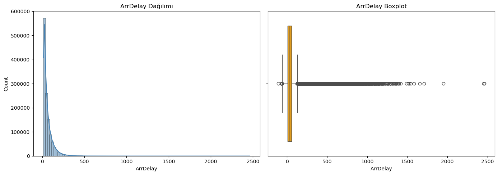
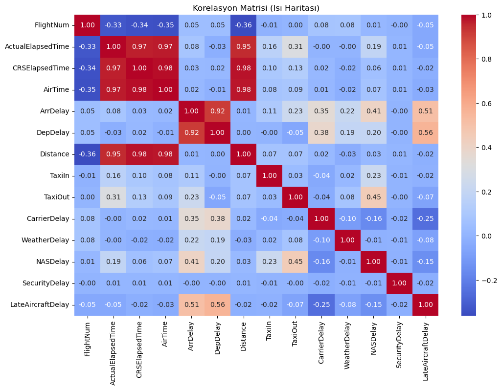
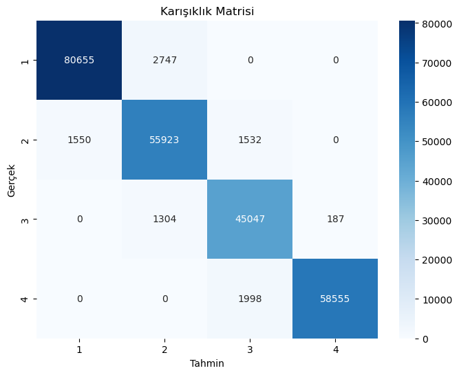

# ***Uçak Varış Gecikmeleri Sınıflandırması Tahmin Modellemesi | Supervised ML Projesi***

## PROJE HAKKINDA
Bu projede, ABD iç hat uçuşlarına ait 1.936.758 satır ve 30 sütundan oluşan veri seti kullanılarak uçuşların varış gecikmeleri sınıflandırılmış ve tahmin modeli üretilmiştir. Amaç, çeşitli gecikme nedenlerini (hava durumu, kalkış gecikmesi, havayolu kaynaklı gecikme vb.) analiz ederek uçuşların zamanında, az gecikmeli, orta veya yüksek düzeyde gecikmeli olacağı önceden tahmin edilebilmesi hedeflenmektedir.

Veri Setinde Bulunan Özellikler (Features):
'Year', 'Month', 'DayofMonth', 'DayOfWeek', 'DepTime', 'CRSDepTime', 'ArrTime', 'CRSArrTime', 'UniqueCarrier', 'FlightNum', 'TailNum', 'ActualElapsedTime', 'CRSElapsedTime', 'AirTime', 'ArrDelay', 'DepDelay', 'Origin', 'Dest', 'Distance', 'TaxiIn', 'TaxiOut', 'Cancelled', 'CancellationCode', 'Diverted', 'CarrierDelay', 'WeatherDelay', 'NASDelay', 'SecurityDelay', 'LateAircraftDelay'

Veri, Kaggle üzerinden csv formatında indirilmiş, Pandas kullanılarak Jupyter Notebook'ta DataFrame’e aktarılmıştır:

```python

import pandas as pd
df = pd.read_csv("/Users/sehersavas/Desktop/DelayedFlights.csv")
df.head()
```
Veri setinde toplam 1.936.758 satır ve 30 sütun bulunmaktadır. Yaklaşık 690.000 satırda eksik veri vardır, eksik veri temizleme işlemi gerekmektedir. UniqueCarrier (hava yolu kodu), TailNum (uçak kuyruk numarası), Origin (kalkış havaalanı kodu) ,Dest (varış havaalanı kodu),CancellationCode (iptal sebebi) (object), geri kalan veriler sayısal formdadır. Veri Ön İşleme esnasında gerekli dönüşümler yapılacaktır.

# Veri Temizliği - Eksik Veri Olan Satırların Temizlenmesi

```pyhton
df_cleaned = df.dropna()
print("Yeni veri kümesinin boyutu:", df_cleaned.shape)
```
Yeni veri kümesinin boyutu: (1247486, 30)
Veri setinde eksik veri bulunan satırlar temizlendikten sonra veriseti 1.247.486 satır ve 30 sütundan oluşmaktadır.

# Keşifsel Veri Analizi- Hedef Değişkene ait Bilgilerin Edinilmesi

```pyhton
import matplotlib.pyplot as plt
import seaborn as sns

plt.figure(figsize=(14, 5))
plt.subplot(1, 2, 1)
sns.histplot(df_cleaned['ArrDelay'], bins=100, kde=True, color='steelblue')
plt.title('ArrDelay Dağılımı')
plt.subplot(1, 2, 2)
sns.boxplot(x=df['ArrDelay'], color='orange')
plt.title('ArrDelay Boxplot')
plt.tight_layout()
plt.show()
```




***Hedef Değişkenin Uç Değerlerinin Tespiti ve Temizlenmesi***


```pyhton
initial_count = df_cleaned.shape[0]
df_filtered = df_cleaned[df_cleaned['ArrDelay'] <= 250]
filtered_count = df_filtered.shape[0]
outliers_removed = initial_count - filtered_count

print(f"Çıkarılan uç değer sayısı (ArrDelay > 250): {outliers_removed}")
print(f"Kalan veri sayısı: {filtered_count}")
print("Eksik veri var mı?:", df_filtered.isnull().sum().sum())
```

Çıkarılan uç değer sayısı (ArrDelay > 250): 20682
Kalan veri sayısı: 1226804
Eksik veri var mı?: 0

Uç değer analizinde, ArrDelay (varış gecikmesi) değişkeni için gecikmelerin 250 dakikaya kadar yoğunlaştığı görüldüğünden 250 dakikanın üzerindeki 20.682 veri uç değer kabul edilip temizlenmiştir, kalan veri sayısı 1.226.804 olmuştur. Eksik veri olup olmadığı kontrol edilmiş, eksik veri olmadığı sonucuna ulaşılmıştır.

***Hedef Değişken ile Özelliklerin İlişkisinin İncelenmesi***

```pyhton
null_cols = ['Month', 'DayofMonth', 'Year', 'DayOfWeek', 'DepTime', 'CRSDepTime', 'ArrTime', 'CRSArrTime', 'Diverted', 'Cancelled', 'Unnamed: 0' ]
binary_cols = [col for col in df_filtered.columns if df_filtered[col].nunique() == 2]
numeric_cols = df_filtered.select_dtypes(include=['int64', 'float64']).columns.tolist()
cols_to_use = [col for col in numeric_cols if col not in null_cols + binary_cols]


if 'ArrDelay' not in cols_to_use:
    cols_to_use.append('ArrDelay')

corr_matrix = df_filtered[cols_to_use].corr()

print("ArrDelay ile korelasyonlar:")
print(corr_matrix['ArrDelay'].sort_values(ascending=False))

plt.figure(figsize=(12, 8))

sns.heatmap(corr_matrix, annot=True, fmt=".2f", cmap='coolwarm', cbar=True)
plt.title('Korelasyon Matrisi (Isı Haritası)')
plt.show()
```




Korelasyon analizi yapılırken öncelikle, null_cols adlı liste oluşturulmuş ve içine zamanla ilgili sütunlar (Month, DayofMonth, Year, DayOfWeek, DepTime, CRSDepTime, ArrTime, CRSArrTime) ile ayrıca modelde anlamlı katkısı olmayabilecek ve analiz dışı bırakılmak istenen Diverted, Cancelled ve indeks görevi gören Unnamed: 0 sütunları eklenmiştir. Bu özellikler korelasyon analizinden çıkarılarak model karmaşasının önüne geçilmek ve anlamlı korelasyonlar elde etmek amaçlanmıştır. Sonrasında, veri içindeki ikili (binary) sütunlar binary_cols olarak tespit edilerek korelasyon analizinde yanıltıcı sonuç alınmasının önüne geçilmiştir. Daha sonra tüm sayısal sütunlar (numeric_cols) seçilmiş ve null_cols ile binary_cols listelerindeki sütunlar çıkarılarak, korelasyonda kullanılacak sütunlar (cols_to_use) oluşturulmuştur. Böylece zamanla ilgili, binary ve gereksiz sütunlar analiz dışında bırakılmıştır. . Kalan sayısal sütunlar arasında korelasyon matrisi hesaplanıp ArrDelay ile olan korelasyonlar yazdırılmış ve görselleştirilmiştir.

***Düşük İlişkili Özelliklerin Temizlenmesi***

```pyhton
selected_features = [
    'DepDelay', 'LateAircraftDelay', 'NASDelay', 'CarrierDelay',
    'TaxiOut', 'WeatherDelay', 'TaxiIn', 'ArrDelay' ]

all_columns = df_cleaned.columns.tolist()
columns_to_drop = [col for col in all_columns if col not in selected_features]
df_selected = df_cleaned.drop(columns=columns_to_drop)

print("Çıkarılan sütunlar:", columns_to_drop)
print("Yeni veri seti sütunları:", df_selected.columns.tolist())
print("Yeni df_cleaned boyutu:", df_selected.shape)
```

Çıkarılan sütunlar: ['Unnamed: 0', 'Year', 'Month', 'DayofMonth', 'DayOfWeek', 'DepTime', 'CRSDepTime', 'ArrTime', 'CRSArrTime', 'UniqueCarrier', 'FlightNum', 'TailNum', 'ActualElapsedTime', 'CRSElapsedTime', 'AirTime', 'Origin', 'Dest', 'Distance', 'Cancelled', 'CancellationCode', 'Diverted', 'SecurityDelay']
Yeni veri seti sütunları: ['ArrDelay', 'DepDelay', 'TaxiIn', 'TaxiOut', 'CarrierDelay', 'WeatherDelay', 'NASDelay', 'LateAircraftDelay']
Yeni df_cleaned boyutu: (1247486, 8)

# Veri Ön İşleme/Özellik Mühendisliği - Hedef Değişkenin Kategorilere Ayrılması

```pyhton
df_selected['ArrDelay_raw'] = df_selected['ArrDelay']
def delay_class_4_v2(x):

    if x <= 30: 
       return 1  # Kısa gecikme
        
    elif x <= 50:
       return 2  # Orta gecikme
        
    elif x <= 80:
       return 3  # Uzun gecikme
        
    else:
      return 4  # Çok uzun gecikme

df_selected['DelayClass'] = df_selected['ArrDelay'].apply(delay_class_4_v2)

print("Gecikme sınıflarına göre veri dağılımı:")
print(df_selected['DelayClass'].value_counts())
```

0 ile 30 dakika arası gecikmeler kısa gecikme olarak kabul edilmiş ve 1. sınıf olarak tanımlanmıştır. Bu aralık, yolcuların çoğunlukla kabul edilebilir bulduğu hafif gecikmeleri temsil eder. Bu kategoride 417.008 veri bulunmaktadır.

31 ile 50 dakika arası gecikmeler orta düzey gecikmeler olup, operasyonel anlamda rahatsızlık yaratabilecek fakat yönetilebilir gecikmeler olarak 2. sınıfa ayrılmıştır. Bu kategoride 302.764 bulunmaktadır.

51 ile 80 dakika arası gecikmeler uzun gecikme kategorisindedir ve uçuşların ciddi şekilde etkilenebileceği durumları ifade eder; bu nedenle 3. sınıf olarak belirlenmiştir. Bu kategoride 295.022 veri bulunmaktadır.

80 dakikadan fazla olan gecikmeler ise kritik derecede uzun gecikmeler olarak değerlendirilmiş ve 4. sınıf olarak tanımlanmıştır. Bu tür gecikmeler genellikle yolcu memnuniyetini ve havayolu operasyonlarını ciddi şekilde etkiler. Bu kategoride 232.692 veri bulunmaktadır.

# x-y değerlerinin tanımlanması ve eğitim/test kümesi ayrımı

```pyhton
from sklearn.model_selection import train_test_split

Bağımsız değişkenler
X = df_selected[['ArrDelay', 'DepDelay', 'TaxiIn', 'TaxiOut', 'CarrierDelay', 'WeatherDelay', 'NASDelay', 'LateAircraftDelay']]

 Hedef değişken
y = df_selected['DelayClass']

Eğitim ve test verisi olarak %80 - %20 ayrımı, sınıf dengesini koruyarak

X_train, X_test, y_train, y_test = train_test_split(
    X, y, test_size=0.2, random_state=42, stratify=y
)

print(f"Eğitim seti boyutu: {X_train.shape[0]} örnek")
print(f"Test seti boyutu: {X_test.shape[0]} örnek")
```

# Veri Ön İşleme - Normalizasyon

```pyhton
from sklearn.preprocessing import StandardScaler
scaler = StandardScaler()

X_train_scaled = scaler.fit_transform(X_train)
X_test_scaled = scaler.transform(X_test)

import pandas as pd

X_train_scaled = pd.DataFrame(X_train_scaled, columns=X_train.columns, index=X_train.index)
X_test_scaled = pd.DataFrame(X_test_scaled, columns=X_test.columns, index=X_test.index)
```

Modelin farklı ölçeklerdeki özelliklerden kaynaklanan yanlılıklardan korunmasını sağlamak ve modelin daha dengeli öğrenmesi amaçlanarak Standart Scaler ile veriseti normalize edilmiştir. Önce yalnızca eğitim verisine fit edilerek, ortalama ve standart sapma hesaplanır; ardından bu istatistikler kullanılarak hem eğitim hem de test verisi dönüştürülmüştür. Böylece her özellik, ortalaması 0 ve standart sapması 1 olacak şekilde yeniden ölçeklenmiştir.Modelin gerçek dünyadaki performansının doğru ölçülmesi amacı ile test verisi için ayrıca fit edilmemiştir

# Logistic Regression Kullanılarak Modelin Oluşturulması 

```pyhton
from sklearn.linear_model import LogisticRegression
from sklearn.metrics import classification_report, confusion_matrix, accuracy_score

model = LogisticRegression(class_weight='balanced', max_iter=1000, random_state=42)
model.fit(X_train_scaled, y_train)

y_pred = model.predict(X_test_scaled)
```

# Modelin Değerlendirilmesi

```pyhton
from sklearn.pipeline import make_pipeline
from sklearn.preprocessing import MinMaxScaler
from sklearn.linear_model import LogisticRegression
from sklearn.model_selection import StratifiedKFold, cross_val_score, train_test_split
from sklearn.metrics import confusion_matrix, classification_report

pipeline = make_pipeline(MinMaxScaler(), LogisticRegression(max_iter=1000, random_state=42, class_weight='balanced'))

cv = StratifiedKFold(n_splits=5, shuffle=True, random_state=42)
cv_scores = cross_val_score(pipeline, X, y, cv=cv, scoring='accuracy', n_jobs=-1)

print("Cross Validation Doğruluk Skorları:", cv_scores)
print("Ortalama Doğruluk:", cv_scores.mean())
print("Standart Sapma:", cv_scores.std())

pipeline.fit(X_train, y_train)
y_train_pred = pipeline.predict(X_train)

print("\nEğitim Seti Performansı:")
print("Confusion Matrix:\n", confusion_matrix(y_train, y_train_pred))
print("Classification Report:\n", classification_report(y_train, y_train_pred))

y_test_pred = pipeline.predict(X_test)

print("\nTest Seti Performansı:")
print("Confusion Matrix:\n", confusion_matrix(y_test, y_test_pred))
print("Classification Report:\n", classification_report(y_test, y_test_pred))

```
Cross Validation Doğruluk Skorları: [0.93327001 0.91560219 0.92250007 0.92319347 0.91925354]
Ortalama Doğruluk: 0.9227638542587637
Standart Sapma: 0.0059033059721381315

Eğitim Seti Performansı:
Confusion Matrix:
 [[319620  13981      5      0]
 [ 19550 204608  11858      1]
 [     0  12579 171125   2450]
 [     0      0  15706 226505]]
Classification Report:
               precision    recall  f1-score   support

           1       0.94      0.96      0.95    333606
           2       0.89      0.87      0.88    236017
           3       0.86      0.92      0.89    186154
           4       0.99      0.94      0.96    242211

    accuracy                           0.92    997988
   macro avg       0.92      0.92      0.92    997988
weighted avg       0.93      0.92      0.92    997988


Test Seti Performansı:
Confusion Matrix:
 [[79911  3491     0     0]
 [ 4894 51193  2918     0]
 [    1  3208 42681   648]
 [    0     0  4005 56548]]
Classification Report:
               precision    recall  f1-score   support

           1       0.94      0.96      0.95     83402
           2       0.88      0.87      0.88     59005
           3       0.86      0.92      0.89     46538
           4       0.99      0.93      0.96     60553

    accuracy                           0.92    249498
   macro avg       0.92      0.92      0.92    249498
weighted avg       0.92      0.92      0.92    249498


Model 5 katlı cross-validation ile ortalama %92,3 doğruluk ve düşük standart sapma (0,0059) göstererek genel olarak tutarlı ve stabil bir performans sergilemektedir. Eğitim setinde sınıflar bazında precision ve recall değerleri yüksek olup özellikle 1. ve 4. sınıflarda %94 üzeri precision ve %94-96 arası recall gözlenmiştir; bu, modelin bu sınıfları hem doğru tahmin etmede hem de eksik bırakmada başarılı olduğunu göstermektedir. 2. ve 3. sınıflarda ise biraz daha düşük ama hâlâ güçlü bir performans (precision ve recall %86-89 arası) vardır, bu da modelin bu sınıfları ayırt etmede biraz daha zorlandığını göstermektedir. Test setinde benzer sonuçlar korunmuş, doğruluk %92 civarında kalmış, recall ve precision değerlerinde ciddi bir düşüş olmamıştır; bu da modelin aşırı öğrenme (overfitting) yapmadığını ve genelleme kabiliyetinin iyi olduğunu göstermektedir. Confusion matrix’te gözlenen sınıflar arası karışıklık, özellikle 2. ve 3. sınıflar arasında olurken, diğer sınıflar için model oldukça net ayrım yapmaktadır. 

Sonuç olarak, model sınıflar arası dengeli bir şekilde yüksek performans sağlamakta olup, özellikle kritik gecikme sınıflarında etkin tahmin yapabilmektedir; ileride model iyileştirmeleri için özellikle 2. ve 3. sınıf tahminlerinin geliştirilmesi hedeflenebilir.

# Modelin Hiperparametre Optimizasyonu Kullanılarak Geliştirilmesi

```pyhton
from sklearn.model_selection import GridSearchCV
from sklearn.linear_model import LogisticRegression
from sklearn.preprocessing import MinMaxScaler


param_grid = {
    'logisticregression__C': [0.01, 0.1, 1, 10],
    'logisticregression__max_iter': [500]
}

grid_search = GridSearchCV(pipeline, param_grid, cv=5, scoring='accuracy', n_jobs=1)
grid_search.fit(X, y)

print("En iyi parametreler:", grid_search.best_params_)
print("En iyi doğruluk:", grid_search.best_score_)
```

Lojistik regresyon modelinin performansını artırmak için hiperparametre optimizasyonu yapıldı. Öncelikle veri ölçeklendirme için MinMaxScaler ve sınıflandırma için LogisticRegression yer alan bir pipeline oluşturuldı. Ardından, modelin önemli iki parametresi olan C (düzenleme gücü) ve max_iter (maksimum iterasyon sayısı) için farklı değerlerin denenmesi amacıyla bir parametre ızgarası (param_grid) belirlendi. GridSearchCV fonksiyonu, bu parametre kombinasyonlarını 5 katlı cross-validation (çapraz doğrulama) ile test edilerek, her biri için modelin doğruluk (accuracy) skoru hesaplandı ve en iyi sonucu veren parametreler belirlenmesi amaçlanmıştır.

Sonuç olarak, modelin en iyi doğruluk değerini C=10 ve max_iter=500 parametreleriyle elde ettiği görüldü. Bu doğruluk oranı %95.38 gibi yüksek bir değeri göstermekte olup modelin verideki sınıfları neredeyse doğru şekilde tahmin ettiği tespit edilmiştir.

C=10 değeri, modelin aşırı uyuma (overfitting'i önlemeye) daha az ağırlık verip, veriye daha esnek uyum sağladığını ifade etmektedir. max_iter=500 ise modelin eğitim sürecinde yeterli sayıda iterasyon yaparak parametreleri optimize ettiğini göstermektedir.

# Optimum Modelin Sonuçlarının Değerlendirilmesi

```pyhton
from sklearn.metrics import confusion_matrix, classification_report, accuracy_score, precision_score, recall_score, f1_score
import matplotlib.pyplot as plt
import seaborn as sns

best_model = grid_search.best_estimator_

y_pred = best_model.predict(X_test)

cm = confusion_matrix(y_test, y_pred)

plt.figure(figsize=(8,6))
sns.heatmap(cm, annot=True, fmt='d', cmap='Blues', xticklabels=best_model.classes_, yticklabels=best_model.classes_)
plt.xlabel('Tahmin')
plt.ylabel('Gerçek')
plt.title('Karışıklık Matrisi')
plt.show()

Performans metrikleri
print("Doğruluk (Accuracy):", accuracy_score(y_test, y_pred))
print("Kesinlik (Precision) (macro):", precision_score(y_test, y_pred, average='macro'))
print("Duyarlılık (Recall) (macro):", recall_score(y_test, y_pred, average='macro'))
print("F1 Skoru (macro):", f1_score(y_test, y_pred, average='macro'))
print("\nClassification Report:\n")
print(classification_report(y_test, y_pred, digits=4))
```

 

Doğruluk (Accuracy): 0.962653007238535

Kesinlik (Precision) (macro): 0.9594368038300068

Duyarlılık (Recall) (macro): 0.9624490140466094

F1 Skoru (macro): 0.9607491510141423

Classification Report:

              precision    recall  f1-score   support

           1     0.9811    0.9671    0.9741     83402
           2     0.9325    0.9478    0.9400     59005
           3     0.9273    0.9680    0.9472     46538
           4     0.9968    0.9670    0.9817     60553

    accuracy                         0.9627    249498
   macro avg     0.9594    0.9624    0.9607    249498
   
weighted avg     0.9634    0.9627    0.9629    249498


Bu çalışmada, havayolu gecikmelerini sınıflandırmak üzere MinMax normalizasyonu ve L2 düzenlemeli Logistic Regression algoritmasından oluşan bir pipeline oluşturulmuştur. Hiperparametre optimizasyonu sonucu elde edilen model, test veri setinde %96,2 doğruluk oranı ve dengeli sınıflandırma başarısı göstermiştir.

Karışıklık matrisi ve sınıf bazlı metrikler incelendiğinde, özellikle Sınıf 1 ve Sınıf 4 için yüksek kesinlik (precision) ve duyarlılık (recall) değerleri elde edilmiştir. Model, sınıf dengesizliğine rağmen başarılı performans sergileyerek tüm sınıflarda tutarlı tahminler yapabilmektedir.

Modelin tahmin olasılıklarının dağılımı da güçlü sınıf ayrımlarına işaret etmekte, bu da operasyonel karar süreçlerinde güvenilirliğini artırmaktadır. Havayolu şirketleri, bu model sayesinde gecikme riski yüksek uçuşları önceden tespit ederek kaynaklarını daha etkin yönetebilir.

Gelecekte modelin performansını artırmak için farklı algoritmalarla karşılaştırmalar yapılması, sınıf dengesizliği tekniklerinin (örneğin SMOTE) uygulanması ve gerçek zamanlı tahmin sistemleri geliştirilmesi üzerine çalışılabilir. Ayrıca zaman serisi verilerinin entegrasyonu ile modelin kapsayıcılığı ve doğruluğu daha da artırılabilir.


[Kaggle Proje Linkim](https://www.kaggle.com/code/sehersava/flight-delay-predict-ml)
 
